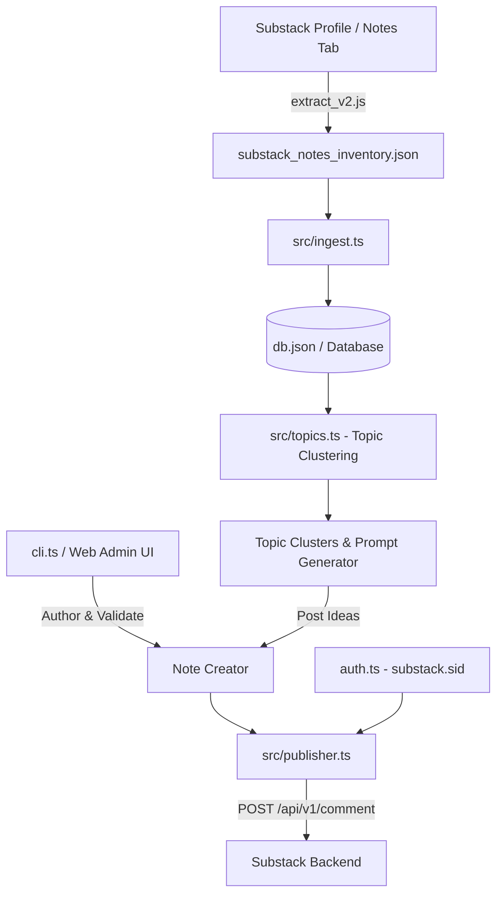

# SNAP: Substack Notes Authoring & Analytics Platform
**Technical Specification & Architecture Document**
*Target Domain*: Substack Notes (`https://substack.com`)
*Integration Target*: Node.js / React / TypeScript Applications

> 📖 **User & Package Guide**: For CLI quickstart, installation, and user commands, see the [Package README (README.md)](README.md).

---

## 1. Executive Summary

**SNAP** (Substack Notes Authoring Platform) is a unified TypeScript-native toolset for creating, publishing, clustering, monitoring, and managing Substack Notes. 

It provides:
1. **Automated Ingestion & Parsing**: Transforms browser-extracted DOM feeds into normalized, clean structured databases.
2. **Topic Management & Content Clustering**: Groups notes into semantic topic clusters, analyzes content density, and generates targeted post ideas for future notes.
3. **Note Authoring & Character Validation**: Markdown preview, hashtag suggestions, character limit checks (~1000 chars for Substack notes), and draft state management.
4. **Substack Web API Client**: Authenticated engine using session cookie (`substack.sid`) for direct note publishing and analytics metrics sync.
5. **Web Application Integration Readiness**: Modular TypeScript architecture designed to be imported directly into React frontends and Node.js server backends.

---

## 2. System Architecture



---

## 3. Data Specification & Schemas

### 3.1 Note Item (`types.ts`)

```typescript
export interface NoteItem {
  id: string;                  // e.g. "c-319089287"
  url: string;                 // e.g. "https://substack.com/@username/note/c-319089287"
  author: {
    name: string;              // e.g. "Author Name"
    handle: string;            // e.g. "username"
  };
  content: {
    raw: string;               // Unparsed raw innerText
    body: string;              // Clean main note text (excluding header metadata)
    hashtags: string[];        // Extracted tags, e.g. ["#AI", "#stripe"]
  };
  is_restack: boolean;         // Quoted or restacked another note
  quoted_note?: {
    author_name: string;
    author_handle: string;
    content: string;
    url: string;
  };
  topic_cluster?: string;      // Primary topic cluster ID
  metrics?: {
    likes?: number;
    restacks?: number;
    replies?: number;
    last_updated?: string;
  };
  status: "DRAFT" | "SCHEDULED" | "PUBLISHED" | "ARCHIVED";
  tags: string[];              // User custom tags
  created_at: string;          // ISO 8601 timestamp
  updated_at: string;
}
```

### 3.2 Topic Cluster (`TopicCluster`)

```typescript
export interface TopicCluster {
  id: string;                  // e.g. "ai-infrastructure"
  title: string;               // e.g. "AI & Infrastructure"
  keywords: string[];          // Key terms matching this cluster
  note_ids: string[];          // List of note IDs belonging to this cluster
  future_post_ideas: string[]; // Ideas generated for follow-up notes
}
```

---

## 4. Authentication Mechanics & Security

Substack Notes does not have an official open developer API key system. SNAP uses authenticated web HTTP requests with Substack session credentials.

### Environment Variables & Session Resolution
SNAP resolves credentials in the following resolution order:
1. Shell Environment Variables (`SUBSTACK_SESSION_ID` & `SUBSTACK_HANDLE`)
2. Local `.env` file in execution directory, `~/.snap/.env`, or project root
3. Hidden user configuration file in `~/.snap/config.json`

### Obtaining the Session Token
1. Log into Substack (`https://substack.com`) in your browser.
2. Open Chrome Developer Tools (`Cmd + Option + I`).
3. Select **Application** -> **Cookies** -> `https://substack.com`.
4. Copy the value of cookie `substack.sid`.
5. Run `snap auth --set <your_token>` or store in `.env`:
   ```env
   SUBSTACK_SESSION_ID="s%3A..."
   SUBSTACK_HANDLE="yourusername"
   ```

### Request Headers & Endpoint
- **Primary Notes Endpoint**: `POST https://substack.com/api/v1/comment/feed`
- **Fallback Subdomain Endpoint**: `POST https://<handle>.substack.com/api/v1/comment/feed`
- **Delete Endpoint**: `DELETE https://substack.com/api/v1/comment/feed/<note_id>`
- **Headers**:
  - `Cookie: substack.sid=<SUBSTACK_SESSION_ID>`
  - `Content-Type: application/json`
  - `Accept: application/json, text/plain, */*`
  - `Origin: https://substack.com`
  - `Referer: https://substack.com/notes`
  - `User-Agent: Mozilla/5.0 ...`

### 4.1 Cloudflare Enterprise WAF Security Boundary
Substack's `POST /api/v1/comment/feed` endpoint is protected by Cloudflare Enterprise Bot Management. Cloudflare verifies JA3/JA4 TLS Client Hello signatures on incoming TCP connections:
- Programmatic HTTP clients (Node `fetch`, `axios`, `curl`) are intercepted at the TLS layer before reaching Substack app servers and returned `HTTP 403 (Forbidden)`.
- Live automated execution requires a browser execution context (Chrome DevTools console or Playwright/Puppeteer automation driver).

---

### 4.2 Substack ProseMirror Document JSON Payload Schema

Substack's rich text editor engine uses **ProseMirror** (a structured document object model JSON tree). When publishing a Note via Substack's API, the `body` parameter must be sent as a serialized ProseMirror document tree (`type: "doc"`).

#### 1. Single & Multi-Paragraph ProseMirror Document Example
```json
{
  "body": {
    "type": "doc",
    "content": [
      {
        "type": "paragraph",
        "content": [
          {
            "type": "text",
            "text": "Stripe is the new tollbooth on the agents highway #AI #payments"
          }
        ]
      },
      {
        "type": "paragraph",
        "content": [
          {
            "type": "text",
            "text": "Second paragraph explaining token routing economics."
          }
        ]
      }
    ]
  },
  "tab": "notes",
  "replyCount": 0
}
```

#### 2. ProseMirror Document with Hyperlinks & Text Marks
```json
{
  "type": "doc",
  "content": [
    {
      "type": "paragraph",
      "content": [
        {
          "type": "text",
          "text": "Check out "
        },
        {
          "type": "text",
          "text": "OpenRouter",
          "marks": [
            {
              "type": "link",
              "attrs": {
                "href": "https://openrouter.ai"
              }
            }
          ]
        },
        {
          "type": "text",
          "text": " for model routing."
        }
      ]
    }
  ]
}
```

#### 3. SNAP ProseMirror Conversion Logic (`src/publisher.ts`)
SNAP converts plain markdown/text into valid ProseMirror document trees via `convertTextToProseMirrorDoc(text)`:

```typescript
export function convertTextToProseMirrorDoc(text: string) {
  const paragraphs = text.split('\n\n').filter(p => p.trim().length > 0);
  return {
    type: "doc",
    content: paragraphs.map(p => ({
      type: "paragraph",
      content: [{ type: "text", text: p.trim() }]
    }))
  };
}
```

---

## 5. Topic Management & Clustering Logic

SNAP analyzes notes by:
1. Extracting explicit `#hashtags` (e.g. `#AI`, `#stripe`, `#economy`, `#startups`, `#software`).
2. Extracting key ngram clusters.
3. Mapping notes into semantic Topic Clusters.
4. Synthesizing **Future Post Ideas** per cluster based on notes patterns.

---

## 6. Integration Guide for Web Applications

1. **CLI Execution**: `snap <command>`
2. **Node/Backend API**: Import modules directly from `src/snap/`:
   ```typescript
   import { FileStorageAdapter } from 'substack-snap';
   import { buildTopicClusters } from 'substack-snap';
   ```
3. **Web Dashboard**: Expose REST/GraphQL endpoints wrapping `ingest`, `topics`, `create`, and `publisher` functions.
